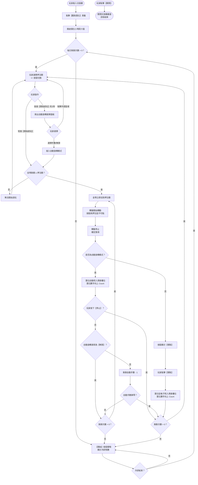

# 03 · 觸發流程

## 完整遊玩流程圖

> **備註**：玩家在遊玩過程中任何時刻皆可點擊【關閉】按鈕直接關閉整個交誼廳畫面。

## 流程階段說明

### 階段一：進入遊戲

| 步驟 | 系統行為 | UI 回饋 |
|------|----------|---------|
| 1 | 玩家從交誼廳點擊【獲取寶石】 | 開啟寶石小瑪莉介面 |
| 2 | 系統檢查每日剩餘遊玩次數 | 若次數 > 0，顯示可遊玩狀態；若為 0，按鈕壓暗並顯示冷卻倒數 |
| 3 | 載入玩家資產資訊 | 上方顯示金幣（左）與寶石（右）數量 |

### 階段二：押注選擇

| 步驟 | 系統行為 | UI 回饋 |
|------|----------|---------|
| 1 | 玩家按 +/- 切換押注額 | 押注區數字變更，轉盤格子數字同步變化 |
| 2 | 到達最大/最小額時繼續按 | 循環跳至最小/最大額 |
| 3 | 格子數字依位數變化 | 數字大小自動縮放 |

### 階段三：遊玩（單次）

| 步驟 | 系統行為 | UI 回饋 |
|------|----------|---------|
| 1 | 玩家點擊【開始遊玩】 | 金幣立即扣除，扣除額 = 當前押注額 |
| 2 | 轉盤開始轉動 | 轉盤區域、押注區、【開始遊玩】按鈕皆不可點 |
| 3 | 轉盤停止，確定獎項 | 選中格子高亮顯示 |
| 4 | 按鈕切換為【領取】 | 玩家點擊後觸發寶石飛入動畫 |
| 5 | 寶石飛入資產欄位 | 寶石數字向上 Count |

### 階段四：自動旋轉

| 步驟 | 系統行為 | UI 回饋 |
|------|----------|---------|
| 1 | 玩家長按【開始遊玩】約 2 秒 | 跳出自動旋轉手數選擇面板（最多 4 選項） |
| 2 | 玩家選擇手數或【無限】 | 面板關閉，按鈕文案根據選擇變化 |
| 3 | 自動執行遊玩循環 | 每手結束後寶石自動飛入，不需按【領取】 |
| 4 | 非【無限】選項：手數每手遞減 | 按鈕上顯示剩餘手數 |
| 5 | 玩家可隨時按【停止】中斷自動旋轉 | 按鈕顯示 STOP，點擊後退出自動模式 |
| 6 | 自動手數歸零或每日次數歸零 | 自動旋轉停止 |

### 階段五：冷卻狀態

| 步驟 | 系統行為 | UI 回饋 |
|------|----------|---------|
| 1 | 每日可遊玩次數歸零 | 【開始】按鈕文案變更並壓暗 |
| 2 | 進入冷卻倒數 | 顯示冷卻剩餘時間 |
| 3 | +/- 按鈕壓暗不可點 | 無法切換押注額 |

## 關鍵分支彙整表

| 分支情境 | 系統行為 | UI 回饋 |
|----------|----------|---------|
| 金幣不足 | 不執行遊玩 | 提示行為 **TBD** |
| 每日次數歸零 | 禁止遊玩，啟動冷卻 | 按鈕壓暗 + 冷卻倒數 |
| 自動旋轉中次數歸零 | 中斷自動旋轉 | 進入冷卻狀態 |
| 自動旋轉面板點擊外部 | 關閉面板，不